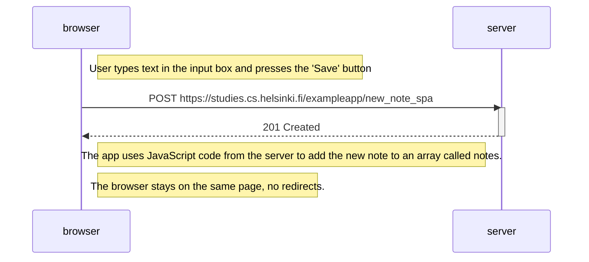

```mermaid
sequenceDiagram
    participant browser
    participant server

    Note right of browser: User types text in the input box and presses the 'Save' button

    browser->>server: POST https://studies.cs.helsinki.fi/exampleapp/new_note_spa
    activate server
    server-->>browser: 201 Created
    deactivate server

    Note left of server: The app uses JavaScript code from the server to add the new note to an array called notes.
    
    Note right of browser: The browser stays on the same page, no redirects.
```